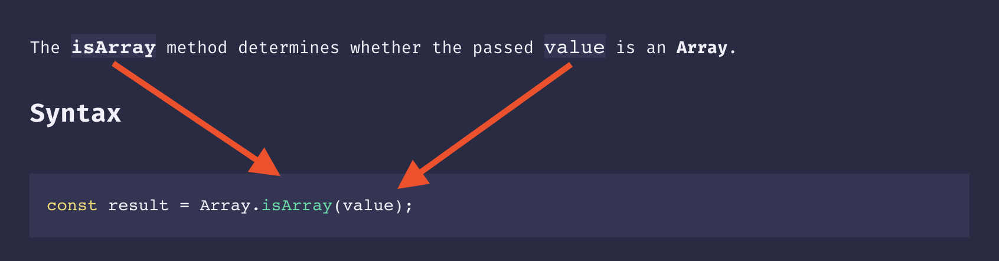

# Contribution guide

## Vision

We strive to provide **noiseless** experience for developers in order to let them stay focused on what they're doing at the moment.

## Goals

When developing the js-tldr we emphasize on the following requirements to every new feature or change:

- consistency
- minimalistic UX
- speed

## Search index

All the documentation is stored in markdown sheets. To be able to register, categorize, and search through them, we're building search index, it consists of two files:

- index.json - describes structure and categories of the markdown files
- search-index.json - collection of the objects that have doc name and body coupled with its path

### The flow of adding a documentation for a new domain

- create domain folder and files for its content
- create entry for the domain and its content in the `index.json`
- Run the command `npm run build:search-index` which will create `search-index.json`

> NOTE: build:search-index command is running during the deploy job, so it is unnecessary to build index manually, unless you need it for tests

### Shape of index.json

```json
{
  "domains": [
    {
      "name": "<Name of the domain>",
      "type": "<The type of the primitive>",
      "description": "<Text note about the domain>",
      "path": "<Path to the domain folder>",
      "methods": {
        "static": [<List of static methods names>],
        "prototype": [List of prototype methods names]
      },
      "properties": {
        "static": [<List of static methods names>],
        "prototype": [List of prototype methods names]
      }
    }
  ]
}
```

### Shape of the search-index.json

```json
{
  "body": "<Documentation body text>",
  "category": "<properties/methods>",
  "name": "<Name of the method/property>",
  "path": "<Path to the file>",
  "searchString": "<Name with a domain context>"
}
```

## Documentation guideline

### Location

We write docs as markdown files which are public and can be accessed by the doc's URL, suffixed with `.md`.
For example:
https://js-tldr.info/docs/Array/concat - doc page
https://js-tldr.info/docs/Array/concat.md - doc markdown sheet

### Shape

Every doc meet the strict shape requirement. It should consist of the following parts:

- title
- short exhaustive description
- syntax - mandatory for methods, may be omitted for properties
- usage examples
- reference link

Doc skeleton example:

````md
# Array.prototype.concat()

<description>

## Syntax

```js
<syntax definition>
```

## Usage examples

```js
<usage examples code>
```

---

[reference](link)
````

### Description

In the description body:

- use **bold + code** markup for the name of the property or method - `` **`methodName`** ``
- _do not_ use parentheses `()` with method name
- use **code** markup for syntax's terms and reflect them in syntax code example. For instance:



### Code

In the syntax and usage examples code body:

- _do not_ use abbreviations for variables names, eg DONT `const str = ...`, DO `const string = ...`
- use the stdout comment `// ->` to show results
- try to avoid using `console.log`, just use stdout comment and the end of method call or property expression
- use only modern ES6 syntax, eg. use `const`/`let` instead of `var`
